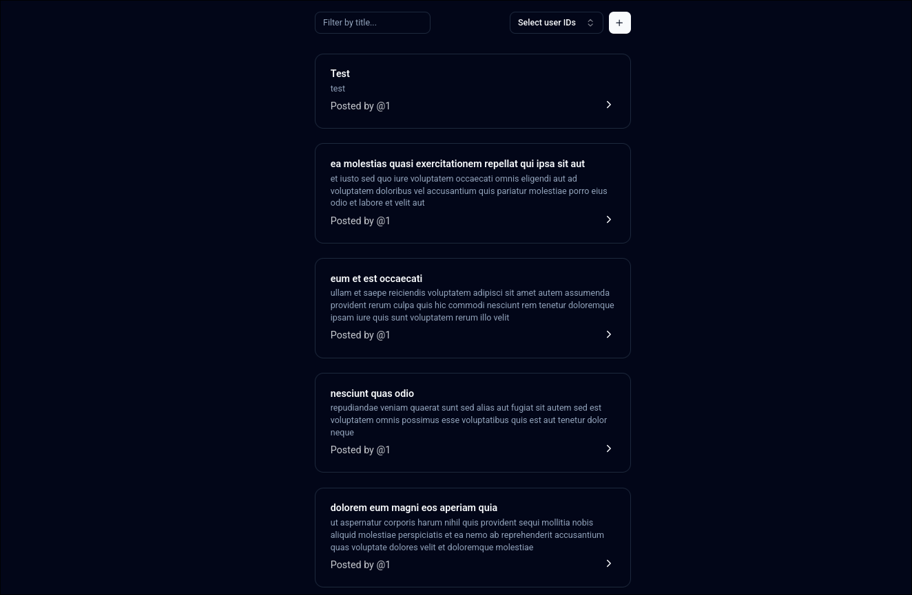

# Adict Test


 
## Запуск

- Установите Node.js, npm и pnpm (по желанию).

- Установите зависимости:

```bash
pnpm install
```

- Запустите сервер:

```bash
pnpm dev
```

После запуска сервера вы можете открыть страницу на <http://localhost:3000>

## Функциональность

- Просмотр всех постов
  - Фильтрация по заголовку
  - Фильтрация по пользователям
- Создание поста
- Детальный просмотр поста
- Редактирование поста
- Удаление поста
- Просмотр комментариев поста

CRUD операции выполнены с помощью **msw**, удаление, изменение и добавление постов сохраняется в файле `data/posts.json`.

## Структура проекта

Frontend

- `/src` - код приложения
- `/src/components` - компоненты приложения
- `/src/hooks` - хуки для работы с API
- `/src/pages` - страницы приложения
- `/src/services` - сервисы для работы с API
- `/src/types` - типы

Backend (моковые данные)

- `/data` - данные для моковых запросов
- `/src/mocks/server` - моковый сервер
- `/src/mocks/handlers` - моковые обработчики запросов

Тесты

- `/src/__tests__` - папка со всеми тестами
- `/src/__tests__/posts.test.tsx` - тесты для постов

## Применение принципов SOLID

### Single Responsibility Principle (Принцип единственной ответственности)

- [`PostCard`](src/components/posts/post-card.tsx) отвечает только за отображение карточки поста
- [`PostActions`](src/components/posts/post/post-actions.tsx) инкапсулирует только логику действий с постом
- [`Pagination`](src/components/pagination.tsx) занимается исключительно пагинацией
- [`GoBackButton`](src/components/go-back-button.tsx) реализует только навигацию назад

### Open/Closed Principle (Принцип открытости/закрытости)

- [`Button`](src/components/ui/button.tsx) расширяется через variants и props, не требуя изменения базовой реализации
- [`Card`](src/components/ui/card.tsx) компоненты расширяются через композицию (CardHeader, CardContent и т.д.)
- [`Dialog`](src/components/ui/dialog.tsx) расширяется через композицию дочерних компонентов

### Interface Segregation Principle (Принцип разделения интерфейсов)

- [`Form`](src/components/ui/form.tsx) разделен на специализированные компоненты (FormField, FormItem, FormControl)
- [`DropdownMenu`](src/components/ui/dropdown-menu.tsx) разбит на специализированные подкомпоненты для разных частей меню

### Dependency Inversion Principle (Принцип инверсии зависимостей)

- [`CreatePost`](src/components/posts/create-post.tsx) использует абстракции через хуки (useCreatePost) вместо прямых зависимостей
- [`PostsFilters`](src/components/posts/posts-filters.tsx) работает с абстракцией хранилища через хук usePostsFiltersStore
- [`CreatePostForm`](src/components/posts/create-post/create-post-form.tsx) работает с абстракцией формы через хук useForm

## Примечания

Использовал tailwind CSS и Shadcn UI для более быстрой разработки.

В [`package.json`](package.json) скрипт `dev` запускает параллельно **vite** и **моковый сервер**.
